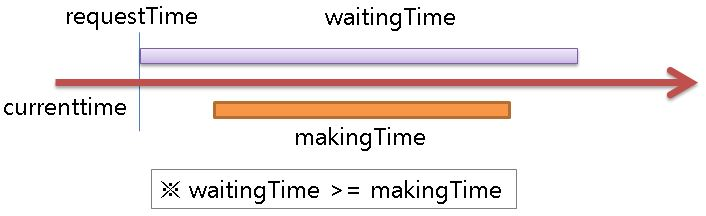

# 가구 장인

 
당신은 가구 공장 사장이다.
가구 공장에서는 1 ~ 32 명의 가구 장인이 일하고 있다.

당신은 주문이 들어온 가구들을 고객들이 원하는 일정(waitingTime)까지 만들도록 가구 장인들의 제작 일정을 스케쥴링해야 한다.

가구 마다 가격과 제작 기간(makingTime)이 다르다. 
( 고객이 가구의 제작 기간보다 짧은 일정을 요구하는 일은 없다 )

고객이 요구한 일정 내에 가구를 만들면, 가구의 가격에 해당하는 돈을 벌게 된다.
장인은 작업 중이던 가구 제작을 멈추고 다른 가구를 제작할 수 있으며,
제작 요청이 들어올 수 있는 최대 가구 수는 10,000이다.



장인에게 가구를 제작하게 하기 위해서는 startMaking(장인 ID, 가구 ID) 함수를 호출한다.
( 이 때, 유효하지 않은 가구 장인 ID나 가구 ID를 사용하거나, 다른 가구 장인이 제작 중인 가구의 제작을 의뢰하는 경우 감점을 받게 된다. )

장인의 가구 제작을 완료하기 위해서는 completeMaking(장인 ID) 함수를 호출한다.
이 때, 가구 제작 기간을 모두 채웠다면 가구는 완성되고 돈을 벌게 된다.
만약 가구 제작시간을 모두 완료하지 못했는데 completeMaking()을 호출한 경우 감점이 된다.
( 이 때, 유효하지 않은 가구 장인 ID를 사용하거나, 해당 장인이 가구 제작 중이 아닌 경우, 장인이 제작중인 가구가 이미 제작 완료된 경우, 혹은 손님이 요구한 일정을 초과한 경우 감점을 받게 된다. )

가구 제작 기간이 모두 채워지지 않은 경우는 잠시 제작을 멈출 수 있으며
이후에 같은 가구 장인 또는 다른 가구 장인이 멈춰져 있던 가구 제작을 이어서 할 수 있다.
장인에게 할당되어 제작중이던 가구의 제작을 멈추는 방법은 그 가구를 제작하고 있는 장인에게 다른 가구를 할당하면 자동으로 멈춘다.


user.cpp에 있는 request() 함수를 통해서 고객의 가구 제작 요청이 접수 되며 request()가 호출되는 시점이 requestTime이 된다.

tick() 함수가 호출 될 때마다 startMaking() completeMaking()함수를 호출해서 각 가구 장인들이 가구를 제작하여 최대 이익을 남길 수 있도록 스케쥴을 조정해 보자.


모든 가구를 제작할 수 없기 때문에 어떤 가구는 제작을 포기해야 할 수 있다.
하지만 매 test case마다 요청 들어온 가구들의 총 가격 비율 이상 (70%) 의 수익을 올려야 한다.
매 test case에서 벌어 들인 가구들의 수입의 합이 최종 점수가 된다.


user.cpp

```c
extern bool startMaking(int masterID, int furnitureID);
extern bool completeMaking(int masterID);

void init(int N) {

}

void request(int furnitureID, int requestTime, int price, int makingTime, int waitingTime) {

}

void tick(int currentTime) {

}

```


main.cpp

```c
#ifndef _CRT_SECURE_NO_WARNINGS
#define _CRT_SECURE_NO_WARNINGS
#endif

#include <stdio.h>

struct Furniture {
	int requestTime;
	int price;
	int makingTime;
	int waitingTime;
	int masterID;
	bool done;
};

#define MAXFURNITURE    10000
static int furnitureNumber;                       // the number of furnitures
static Furniture furniture[MAXFURNITURE + 1];

struct Master {
	int furnitureID;
	int startMakingTime;
};

#define MAXMASTER     32
static int masterCount;                       // the number of masters
static Master master[MAXMASTER + 1];

static int waitingTime;
static int currentTime;
static int earned;
static int total;
static bool success;
static int testcase;
static int TC;

extern void init(int N);
extern void request(int furnitureID, int requestTime, int price, int makingTime, int waitingTime);
extern void tick(int currentTime);

bool startMaking(int masterID, int furnitureID) {
	if (masterID <= 0 || masterID > masterCount ||
		furnitureID <= 0 || furnitureID > furnitureNumber ||
		furniture[furnitureID].requestTime > currentTime ||
		furniture[furnitureID].masterID != -1)
		return success = false;

	if (master[masterID].furnitureID != -1) {
		furniture[master[masterID].furnitureID].makingTime -= currentTime - master[masterID].startMakingTime;
		furniture[master[masterID].furnitureID].masterID = -1;
	}

	master[masterID].furnitureID = furnitureID;
	master[masterID].startMakingTime = currentTime;
	furniture[furnitureID].masterID = masterID;

	return true;
}

bool completeMaking(int masterID) {
	int furnitureID;
	if (masterID <= 0 || masterID > masterCount ||
		(furnitureID = master[masterID].furnitureID) == -1 ||
		furniture[furnitureID].done == true ||
		furniture[furnitureID].makingTime > currentTime - master[masterID].startMakingTime ||
		currentTime > furniture[furnitureID].requestTime + furniture[furnitureID].waitingTime)
		return success = false;

	earned += furniture[furnitureID].price;
	furniture[furnitureID].done = true;
	master[masterID].furnitureID = -1;

	return true;
}

static void run() {
	scanf("%d", &masterCount);
	for (int idx = 1; idx <= masterCount; ++idx)
		master[idx].furnitureID = -1;

	init(masterCount);

	total = 0;
	waitingTime = 0;
	furnitureNumber = 1;
	currentTime = 0;
	while (1) {
		scanf("%d", &furniture[furnitureNumber].requestTime);
		if (furniture[furnitureNumber].requestTime < 0) break;
		while (furniture[furnitureNumber].requestTime > currentTime) {
			tick(currentTime);
			currentTime++;
		}
		scanf("%d %d %d", &furniture[furnitureNumber].price,
			&furniture[furnitureNumber].makingTime,
			&furniture[furnitureNumber].waitingTime);
		furniture[furnitureNumber].masterID = -1;
		furniture[furnitureNumber].done = false;
		total += furniture[furnitureNumber].price;
		if (furniture[furnitureNumber].requestTime + furniture[furnitureNumber].waitingTime > waitingTime) {
			waitingTime = furniture[furnitureNumber].requestTime + furniture[furnitureNumber].waitingTime;
		}
		request(furnitureNumber,
			furniture[furnitureNumber].requestTime,
			furniture[furnitureNumber].price,
			furniture[furnitureNumber].makingTime,
			furniture[furnitureNumber].waitingTime);
		++furnitureNumber;
	}

	while (currentTime <= waitingTime) {
		tick(currentTime);
		currentTime++;
		if (!success) return;
	}
}

#define PRODUCTION_RATE       70

int main() {
	setbuf(stdout, NULL);

	int totalscore = 0;

	scanf("%d", &TC);

	for (testcase = 1; testcase <= TC; ++testcase) {
		earned = 0;
		success = true;
		run();
		if (success && earned * 100 / total >= PRODUCTION_RATE) 
			totalscore += earned;
		else 
			totalscore -= 10000000;
		printf("#%d %d / %d\n", testcase, earned, total);
	}

	if (totalscore < 0) totalscore = 0;
	printf("#total score : %d\n", totalscore);
	if (totalscore > 0) return 0;
	return -1;
}
```
