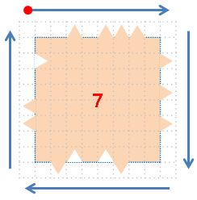
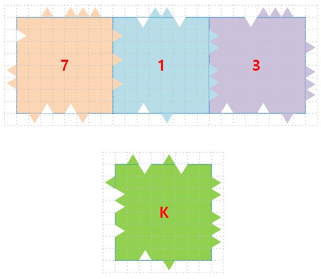
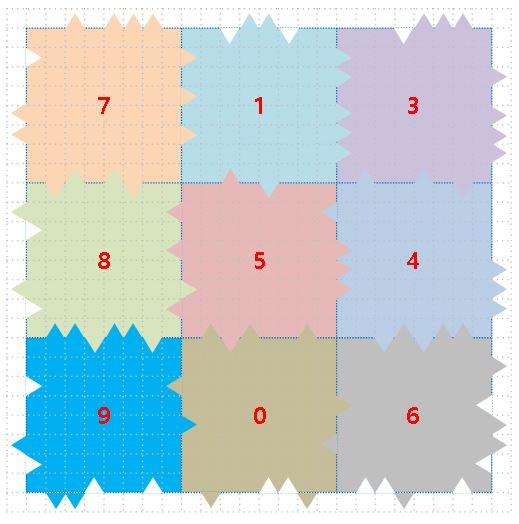
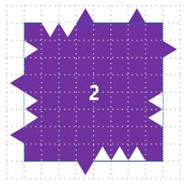

# 보물지도


Time Limit 3000 ms

해리슨은 보물사냥꾼이다.

엄청난 보물이 묻혀 있는 보물지도를 구해 보물을 찾으러 떠날 마음에 흥분되어 있었다.

하지만 보물지도 관리를 소흘히 해 막내 아들 리버가 갈기갈기 찢어버렸다.

더군다나 리버가 가지고 놀던 장난감 보물지도 조각(K)과 섞여버렸다. (1 ≤ K ≤ 5)

당신은 해리슨을 도와 보물지도를 완성하고 보물지도 가운데에 있는 보물을 획득하라.


보물지도는 N*N개의 조각으로 나눠져있다. (3 ≤ N ≤ 49, N은 홀수)

보물지도 조각들의 크기는 각 TC마다 균일하며 M*M 크기이다. (8 ≤ M ≤ 15)

조각 정보는 좌상귀부터 시계방향으로 상, 우, 하, 좌 순서로 호출되며 각 꼭지점은 0 값을 가진다.

돌출된 부분은 1, 들어간 부분 -1로 포현되며 평탄한 부분은 0으로 표현된다.





[ 7]  0 0 1 0 1 1 1 0  0 1 0 1 0 1 0 0  0 0 1-1 0-1 1 0  0 0 1 1 0 0-1 0


보물지도 조각들의 잘려진 단면은 1:1로 매칭이 된다.

즉 모든 보물지도 조각의 단면끼리 일치하도록 맞춘다면 조각나기 이전 보물지도를 완성할 수 있다.

그런데 장난감 보물지도의 조각의 단면이 기존 보물지도 조각의 단면과 일치하는 경우가 있다.

아래 그림을 보면 K 조각은 1번 조각의 우측면과 아래쪽 면이 같다.

하지만 위쪽면과 왼쪽면이 다르기 때문에 K 조각이 1번 조각을 대체해서 보물지도를 완성할 수 없다.





보물지도를 완성하지 않고 조각만으로 진짜 보물지도의 조각인지 장난감 보물지도의 조각인지 판별하기 쉽지 않다.

하나 이상의 장난감 보물지도 조각으로 기존 보물지도 조각을 대체해서 보물지도를 완성할 수 없다.

반드시 진짜 보물지도 조각으로만 보물지도를 완성할 수 있다.


< 함수 설명 >


```
void init(int N, int M, int K)
N: 보물지도 한변을 완성하는데 필요한 조각 개수 (3 ≤ N ≤ 49, N은 홀수)
M: 보물지도 조각의 크기 (8 ≤ M ≤ 15)
K: 장난감 보물지도 조각 개수 (1 ≤ K ≤ 5)
매 TC 초기에 한 번 호출된다.
```


```
void addPiece(int piece[])
piece: 한 조각의 정보. 1, 0, -1로 구성되며 길이는 M * 4 이다.
매 TC 마다 N * N + K 번 호출 된다.
진짜 보물지도 조각과 장난감 보물지도 조각 정보가 순서없이 전달된다.
조각 정보는 좌상귀부터 시계방향으로 상, 우, 하, 좌 순서로 호출되며 각 꼭지점은 0 값을 가진다.
돌출된 부분은 1, 들어간 부분 -1로 포현되며 평탄한 부분은 0으로 표현된다.
전달되는 조각은 완성될 보물지도 기준으로 회전되지 않은 상태로 전달됨을 보장한다.
```


```
int getTreasure()
addPiece() 함수를 모두 호출하고 TC 마지막으로 호출된다.
보물지도를 완성하고 보물의 정보를 확인하라.
보물의 정보는 완성된 보물지도 가운데에 있는 조각의 잘려진 단면 중 튀어나온 부분(1)의 개수이다.
```


< 예제 >

다음과 같이 N=3, M=8, K=1인 보물지도 조각들의 정보가 주어졌다고 가정하자.

[ 0]  0 1-1 1 0 0 1 0  0 0 0 1 0-1 0 0  0 1-1-1 0 0 1 0  0 0 0-1 0 1 0 0

[ 1]  0 0-1 1 1-1 0 0  0 1 1 0 1 1 1 0  0 0 0 1 0-1 0 0  0 0-1 0-1 0-1 0

[ 2]  0-1-1 1 0 0 1 0  0 1 0 0-1-1 0 0  0-1-1-1 1 0 0 0  0 1-1-1 1 0-1 0

[ 3]  0 0 0-1 1 1 1 0  0 0 1 0 1 1 1 0  0 1 0-1 0 0-1 0  0-1-1-1 0-1-1 0

[ 4]  0 1 0 0 1 0-1 0  0 0 0 0 1 1 1 0  0-1-1 1-1 1 0 0  0 0-1-1-1 0 1 0

[ 5]  0 0 1 0-1 0 0 0  0-1 0 1 1 1 0 0  0-1 0 0-1 1-1 0  0 1-1 0 1 0 1 0

[ 6]  0 0-1 1-1 1 1 0  0 1 0-1 1 1-1 0  0-1 0 0 1-1-1 0  0 0 1 0-1 0 0 0

[ 7]  0 0 1 0 1 1 1 0  0 1 0 1 0 1 0 0  0 0 1-1 0-1 1 0  0 0 1 1 0 0-1 0

[ 8]  0-1 1 0 1-1 0 0  0-1 0-1 0 1-1 0  0 1-1-1 1-1-1 0  0-1 1 0 0-1 1 0

[ 9]  0 1 1-1 1 1-1 0  0 0-1 0 1 0 0 0  0-1 0 0-1 1 1 0  0-1 1 0 0-1 0 0


이 조각들을 이용해서 보물지도를 완성하면 다음과 같다.







2번 조각은 장난감 퍼즐 조각이다.

완성된 보물지도의 가운데(5번 조각) 보물지도 정보(돌출부분(1) 개수)를 확인하면 8이다.


user.cpp

```c++

void init(int n, int m, int k) {
}

void addPiece(int piece[]) {
}

int getTreasure() {
}

```

main.cpp
```c++
#ifndef _CRT_SECURE_NO_WARNINGS
#define _CRT_SECURE_NO_WARNINGS
#endif

#include <stdio.h>
#include <time.h>

clock_t startTime;
void begin() {
	startTime = clock();
}

void end() {
	printf("%.3f time used\n", ((float)clock() - startTime) / CLOCKS_PER_SEC);
}

extern void init(int N, int M, int K);
extern void addPiece(int piece[]);
extern int getTreasure();

static unsigned int seed = 12345;
static unsigned int pseudo_rand(int max) {
	seed = ((unsigned long long)seed * 1103515245 + 12345) & 0x7FFFFFFF;
	return seed % max;
}

static int tc;
static int N, M, K;
static int side[2][51 * 51]; // 0: 상하 1: 좌우
static int getNewSide() {
	int s = 1;
	for (int i = 1; i < M - 1; ++i) {
		int j = pseudo_rand(3);
		s *= 3;
		s += j;
	}
	s = s * 3 + 1;
	return s;
}

static int getReverse(int s) {
	int r = 1;
	s /= 3;
	for (int i = 1; i < M - 1; ++i) {
		r *= 3;
		r += 2 - s % 3;
		s /= 3;
	}
	r = r * 3 + 1;
	return r;
}

static int getSide(int y, int x, int s) {
	return side[s % 2][(y + (s == 2 ? 1 : 0))*(N + 1) + (x + (s == 1 ? 1 : 0))];
}

static void convertPiece(int piece[60], int up, int right, int down, int left) {
	int i = 0;
	// UP
	for (; i < M; ++i) {
		piece[M - 1 - i] = up % 3 - 1;
		up /= 3;
	}
	// RIGHT
	for (; i - M < M; ++i) {
		piece[M*2 - 1 - (i - M)] = right % 3 - 1;
		right /= 3;
	}
	// DOWN
	int d = getReverse(down);
	for (; i - M * 2 < M; ++i) {
		piece[M * 3 - 1 - (i - M * 2)] = d % 3 - 1;
		d /= 3;
	}
	// LEFT
	int L = getReverse(left);
	for (; i - M * 3 < M; ++i) {
		piece[M * 4 - 1 - (i - M * 3)] = L % 3 - 1;
		L /= 3;
	}
}

static int run() {
	scanf("%d %d %d", &N, &M, &K);

	init(N, M, K);

	int change1, change2, change3;
	scanf("%d %d %d %d", &seed, &change1, &change2, &change3);

	for (int s = 0; s < 2; ++s) {
		for (int i = 0; i < N + 1 - s; ++i) {
			for (int j = 0; j <= N + s - 1; ++j) {
				if (change1 == s && change2 == i && change3 == j)
					scanf("%d %d %d %d", &seed, &change1, &change2, &change3);
				side[s][i*(N + 1) + j] = getNewSide();
			}
		}
	}
	int Kpiece[5][60];
	int tempSide[4];
	for (int i = 0; i < K; ++i) {
		scanf("%d %d %d %d", &tempSide[0], &tempSide[1], &tempSide[2], &tempSide[3]);
		convertPiece(Kpiece[i], tempSide[0], tempSide[1], tempSide[2], tempSide[3]);
	}
	scanf("%d", &seed);

	bool useP[49][49] = { false };
	bool useK[5] = { false };
	int piece[60];
	int kCnt = K;
	int total = N * N + K;
	for (int i = 0; i < total; ++i) {
		bool added = false;
		if (kCnt > 0) {
			if (total - i == kCnt ||
				pseudo_rand(total - i) < kCnt) {
				int index = pseudo_rand(K);;
				while (useK[index]) {
					++index;
					if (index >= K) index = 0;
				}
				useK[index] = true;
				for (int j = 0; j < M * 4; ++j)
					piece[j] = Kpiece[index][j];
				--kCnt;
				added = true;
			}
		}
		if (!added) {
			int y = pseudo_rand(N);
			int x = pseudo_rand(N);
			while (useP[y][x]) {
				if (++y >= N) {
					y = 0;
					if (++x >= N) x = 0;
				}
			}
			useP[y][x] = true;
			for (int j = 0; j < 4; ++j) 
				tempSide[j] = getSide(y, x, j);
			convertPiece(piece, tempSide[0], tempSide[1], tempSide[2], tempSide[3]);
		}

		addPiece(piece);
	}
	return getTreasure();
}

int main() {
	//begin();
	setbuf(stdout, NULL);
	//freopen("input_kata.txt", "r", stdin);

	int T;
	scanf("%d", &T);

	int total = 0;
	for (tc = 1; tc <= T; tc++) {
		int result, check;
		result = run();
		scanf("%d", &check);
		if (check == result) total += 100;
		else printf("#%d result(%d) != correct(%d)\n", tc, result, check);
	}
	printf("#total score : %d\n", total / T);

	//end();
	if(total / T < 100) return -1;
	return 0;
}

```
