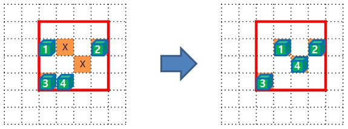

당신은 컨테이너 하역장(100x100)을 관리하고 있다.

크레인들을 이용해서 컨테이너들(2~7)을 이동시켜야 한다.

컨테이너들을 이동시켜서 놓아야할 모양(shape)은 주어지지만 위치가 정확하지 않다.

하역장을 벗어나지 않는 한도 내에서 컨테이너를 이동하여 배치하면 된다.

컨테이너들은 크레인들에 의해서 이동되는데

한 번의 명령으로 각 크레인들은 각 컨테이너들을 한 개씩 한 번에 상하좌우 한 칸씩만 이동이 가능하다.

그리고 크레인들은 HOLD된 컨테이너들을 제외하고 이동명령을 받은 모든 컨테이너들을 동시에 이동시킨다.

※ 명령은 main.cpp에 있는 controlCranes() 함수 사용


아래 그림과 같이 컨테이너들이 위치해 있고 이동해야할 shape이 주어졌다고 가정하자.

 - 컨테이너: 1(y=2, x=2), 2(2, 5), 3(4, 2), 4(4, 3)

 - shape: W(4), H(4)


그림을 보면 컨테이너 4개(1~4)를 X 표시의 모양이 되도록 이동시켜야 한다.

어떤 컨테이너를 어떤 X 표시로 옮기든 상관 없다.

시간을 단축시키기 위해 명령을 최소화 해야 하고

전력사용을 최소화하기 위해 이동을 최소화 해야 한다.

다음 그림과 같이 컨테이너와 shape을 align하면 총 두 번의 명령과 다섯 번의 이동으로 일치시킬 수 있다.

첫 번째 명령: 컨테이너 1(DOWN), 2(DOWN), 3(DOWN), 4(RIGHT)

두 번째 명령: 컨테이너 1(RIGHT), 2(HOLD), 3(HOLD), 4(HOLD)


컨테이너 1번은 두 번, 나머지 컨테이너들은 1번씩 움직여서 shape과 일치시키게 된다.

(score: W(4)*H(4)*shapeCnt(1)-(container(4)*orderCnt(2)+usedPower(5)) = 3)

※ 이 경우 move() 함수가 반환하는 shape의 기준 좌표는 y(2), x(2)가 된다.


그런데 처음 주어진 컨테이너와 shape을 다음 그림과 같이 align했다면

명령을 두 번 내리는 것은 같지만 세 번의 이동으로 일치시킬 수 있다.

(2번과 3번 컨테이너는 align과 동시에 목적지에 있기 때문에 이동할 필요가 없다)

첫 번째 명령: 컨테이너 1(RIGHT), 2(HOLD), 3(HOLD), 4(RIGHT)

두 번째 명령: 컨테이너 1(HOLD), 2(HOLD), 3(HOLD), 4(UP)




컨테이너 1번은 1번, 4번 컨테이너는 2번 이동했다. 그리고 2번과 3번 컨테이너는 움직이지 않았다.

(score: W(4)*H(4)*shapeCnt(1)-(container(4)*orderCnt(2)+usedPower(3)) = 5)

※ 이 경우 move() 함수가 반환하는 좌표는 y(1), x(2)가 된다.


shape의 위치는 주어지지 않기 때문에 적당한 위치를 선정해야 한다.

컨테이너들이 하역장을 벗어나지 않은 한도내에서 shape만 일치시키면 된다.

단, 크레인들이 컨테이너들을 옮길 때 유의할 사항이 있다.

두 대 이상의 크레인들이 컨테이너들을 동시에 한 장소로 이동시키면 안된다.

그러면 컨테이너들이 부딪쳐서 부서질 수 있기 때문이다.

단 HOLD된 컨테이너 위에 다른 컨테이너를 쌓을 수 있다.

HOLD된 컨테이너는 하역장 바닥에 놓여져 있기 때문이다.

그리고 두 대의 크레인들이 컨테이너들을 교차시킬 수 있다.

크레인들은 이동시 다른 크레인들과 충돌이 없도록 이동하기 때문이다.

하지만 두 컨테이너가 교차되는 것은 동일한 형태가 되므로 불필요한 이동이 될 수 있다.


< 함수 설명 >

```c
void init(int cantainerCnt, int containerX[MAX_CONTAINER], int containerY[MAX_CONTAINER])
```
* cantainerCnt: 컨테이너 수
* containerX: 컨테이너 X 좌표
* containerY: 컨테이너 Y 좌표
* 각 testcase 초기에 한 번 호출되면 최초 컨테이너 위치를 알려준다.


```c
COORDINATE move(int W, int H, int shape[MAX_SIZE][MAX_SIZE])
```
* W: shape의 가로 길이
* H: shape의 세로 길이
* shape: shape 형태. 위치해야 할 형태를 1로 표시한다.
* 이 함수는 하역장에 위치할 shape의 base(좌,상) 좌표를 반환해야 한다.


```c
extern bool controlCranes(int direction[MAX_CONTAINER])
```
* direction: 각 컨테이너들의 이동할 방향
* 이동이 성공하면 true를 실패하면 false를 반환한다.
* main에 위치한 함수로 크레인을 조정해서 컨테이너들을 이동시킨다.


정리하면 다음과 같다.

1. 하역장 크기는 100x100 이다.

2. 주어진 컨테이너는 2 ~ 7개이며 x,y값으로 표현되며 좌표값은 각각 0~99값을 가진다.

3. 컨테이너 이동에 필요한 충분한 크레인이 준비되어 있다.

4. 크레인들은 컨테이너들을 한 번의 명령에 상하좌우 중 한 방향으로 한 칸만 이동할 수 있다.

5. 컨테이너를 이동하지 않고 HOLD 할 수 있다.

6. HOLD된 컨테이너는 하역장에 내려놓게 되고 다른 컨테이너를 그 위에 쌓을 수 있다.

7. 주어진 shape 형태로 컨테이너를 배치해야 하는데 컨테이너 수와 shape내 표시된 위치의 개수는 같다.

8. 각 TC마다 주어지는 shape은 최대 10가지이다.


최소 이동 명령과 최소 이동으로 컨테이너들을 주어진 shape와 일치시켜라.
