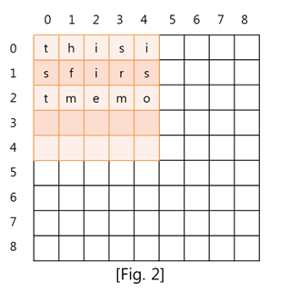

## 문제 설명

메모관리 기능을 제공하는 프로그램인 GMemo를 구현하려고 한다. GMemo의 특징은 다음과 같다. 

메모를 출력하는 전체 화면의 높이와 너비 N은 최대 1,000 이다. 

좌표는 ( Y축 좌표 , X축 좌표 )로 표기하고, 각 좌표의 값은 0 에서 N - 1 의 값을 가진다. 

좌표의 표기에 대해서는 [Fig. 1] 을 참고하자. 


이 프로그램은 화면에 최대 50 * 50 크기의 메모들을 최대 10,000 개까지 생성할 수 있다.

그리고 이미 생성한 메모를 선택하거나, 다른 좌표로 이동하거나, 메모의 크기 및 내용을 수정하는 기능을 제공한다.

마지막으로 화면의 특정 영역에서 보여지는 메모의 내용을 가져오는 기능도 제공한다.

메모들은 같은 좌표에서 전체 혹은 부분적으로 서로 겹쳐질 수 있다.

메모는 생성, 선택, 이동, 수정된 후에 화면의 제일 앞쪽에 위치하게 되는데, 메모들이 겹쳐지는 영역에서는 제일 앞쪽에 위치한 메모의 내용이 출력된다. 

메모를 관리하는 4 가지 기능과, 메모의 내용을 가져오는 기능이 어떻게 동작하는지 다음의 예를 통해 살펴보자. 

먼저 좌표 ( 0 , 0 ) 에 크기 5 * 5 인 메모를 [Fig. 2] 과 같이 생성하였다. 

메모는 메모의 첫 번째 행 첫 번째 열이 주어진 좌표에 위치하도록 생성한다. 

메모에 입력한 내용은 “thisisfirstmemo” 이다. 

입력한 내용의 길이는 15 이고 메모의 너비가 5 이기 때문에, 한 행에 5 개의 문자씩 총 3 행에 저장되었다. 



다음은 좌표( 2 , 3 ) 에 크기 4 * 5 인 메모를 [Fig. 3]와 같이 생성하였다. 

두번째 메모에 입력한 내용은 “thisissecondmemo”이다. 

새로 생성된 메모는 화면의 제일 앞에 위치한다. 

따라서 첫번째 메모와 두번째 메모가 겹쳐지는 영역에는, 나중에 생성된 두번째 메모가 제일 앞쪽에 위치한다. 


다음은 좌표 ( 1 , 4 ) 에 크기 5 * 5 인 메모를 [Fig. 4] 과 같이 생성하였다.

세번째 메모에 입력한 내용은 “thisisthirdmemooverflowswillbeignored”이다.

메모 내용의 길이의 크기가 메모의 크기보다 크기 때문에 25 보다 큰 인덱스의 문자열은 화면에 보여지지 않는다.


다음은 두번째 메모가 좌표( 2 , 2 ) 으로 이동하였다.

이동한 메모는 화면의 제일 앞에 위치한다.

따라서 [Fig. 5] 에서는 두번째 메모가 화면의 제일 앞에 위치하고, 그 다음으로 세번째 메모, 첫번째 메모가 위치한다.


다음으로 첫번째 메모를 선택하였다.

따라서 첫번째 메모는 화면의 제일 앞에 위치한다.

전체 화면의 상태는 [Fig. 6] 과 같다.


[Fig. 6]의 상태에서 좌표 ( 0 , 3 ) 를 기준으로 화면 내용 가져오기가 실행되면 [Fig. 7]의 빨간 사각형 영역의 화면 내용을 반환하면 된다.

화면 내용 가져오기는 항상 5 * 5 크기의 내용을 가져온다.

__메모가 없는 영역과, 메모 내의 빈 공간은 ‘\0’ 문자로 채워서 반환한다.__


[Fig. 7]에서 화면 내용에 대한 반환 값은 [Fig. 8]을 참고하자.


마지막으로 세번째 메모의 크기를 3 * 1 로 변경하고, 메모의 내용을 “modify”로 변경하였다.

세번째 메모는 화면의 제일 앞에 위치한다.

전체 화면의 상태는 [Fig. 9]와 같다.


위와 같은 기능을 제공하는 메모관리 프로그램을 구현해라. 

__다음은 구현해야 할 API이다.__

* 아래 함수 signature는 C/C++에 대한 것으로 Java에 대해서는 제공되는 Solution.java와 UserSolution.java를 참고하라. 
* Java인 경우 char는 2 byte로 구성되어 있지만, 하위 byte만 사용한다.	


```c
void init(int mScreenSize) 	
```
```
testcase 시작시 한번 호출된다. 

Parameter        
  mScreenSize : 화면의 높이와 너비 (5 ≤ mScreenSize ≤ 1,000)	
```

```c
void create_memo(int mId, int mY, int mX, int mHeight, int mWidth, char str[])		
```
```
좌표 ( mY , mX )에 메모를 생성하는 함수이다. 

생성 한 메모를 화면의 제일 앞에 위치시킨다. 

Parameters        
   mId : 생성할 메모의 id
   mY : 메모의 Y축 좌표
   mX : 메모의 X축 좌표	
   mHeight : 메모의 높이 (1 ≤ mHeight ≤ 50)
   mWidth : 메모의 너비 (1 ≤ mWidth ≤ 50)
   str[] : 메모에 입력할 문자열
```

```c
AXIS select_memo(int mId)	
```
```
id 값이 mId 인 메모를 선택한다. 
선택한 메모를 화면상의 제일 앞에 위치시킨다. 

Parameter        
   mId : 선택할 메모의 id	

Return 
   선택한 메모의 좌표( Y , X ) 
```

```c
void move_memo(int mId, int mY, int mX) 	
```
```
id 값이 mId 인 메모의 위치를 좌표 ( mY , mX )로 이동한다. 
이동한 메모를 화면상의 제일 앞에 위치시킨다. 

Parameters	
   mId : 선택할 메모의 id
   mY : 메모의 Y좌표
   mX : 메모의 X좌표
```

```c
void modify_memo(int mId, int mHeight, int mWidth, char str[]) 	
```
```
id값이 mId인 메모의 높이를 mHeight, 너비를 mWidth로 바꾼다. 
기존에 입력된 메모의 내용을 삭제하고, str[] 을 새로운 내용으로 입력한다. 
수정한 메모를 화면상의 제일 앞에 위치시킨다. 

Parameters	
   mId : 선택할 메모의 id
   mHeight : 메모의 높이
   mWidth : 메모의 너비
   str[] : 메모에 입력할 문자열
```

```c
void get_screen_context(int mY, int mX, char res[5][5]) 	
```
```
좌표 ( mY , mX ) 기준으로 높이 5, 너비 5 영역의 화면에 보여지는 내용을 res[][] 배열에 저장한다. 

Parameters	
   mY : 가져올 영역의 상단 Y 좌표
   mX : 가져올 영역의 좌측 X 좌표
   res[5][5] : 화면에 보여지는 내용을 저장하는 배열
```


## 예제

첫번째 testcase에서 주어지는 화면의 크기는 8 이고 메모의 최대 크기는 3 * 3 이다. 

이 testcase에서는 메모를 생성하는 입력들이 주어진다. 

[Table. 1] 에서 간단히 입력의 순서를 설명한다. 


[Table. 2] 은 [Table. 1] 의 순서 4에서 get_screen_context(3, 3) 함수가 호출될 때, 화면의 상태를 설명한다. 

순서 1, 2, 3 에서 메모가 3 개 생성되었다. 

각각의 좌표는 ( 0 , 6 ), ( 1 , 3 ), ( 1 , 4 )이고 크기는 3 * 2, 3 * 2, 2 * 2 이다. 

빨간색 테두리안의 내용이 이 함수에서 반환해야 할 내용이다. 


[Table. 3]는 순서 6에서 get_screen_context(0, 3) 함수가 호출될 때, 화면의 상태를 설명한다.

순서 5에서 좌표( 5 , 2 ) 에 1 * 3 크기의 메모가 생성되었다.


[Table. 4]는 순서 8 에서 get_screen_context(0, 3) 함수가 호출될 때, 화면의 상태를 설명한다.

순서 7 에서 좌표( 0 , 6 ) 에 3 * 2 의 메모가 새로 생성되었다.

새로 생성된 메모는 화면의 앞에 위치하기 때문에 기존에 생성되었던 메모는 보이지 않는다.


두번째 testcase에서 주어지는 화면의 크기는 10 이고 메모의 최대 크기는 5 * 5 이다. 

이 testcase에서는 메모 생성, 선택, 이동, 수정 하는 입력들이 주어진다. 

[Table. 5]에서 간단한 입력 순서를 설명한다. 


[Table. 6]은 순서 5 에서 get_screen_context(5, 0) 가 호출될 때 화면의 상태를 나타낸다. 

순서 1, 2, 3 에서 id가 0, 1, 2 인 메모가 각각 생성되었다. 

각각의 메모가 생성된 좌표는 ( 0 , 5 ), ( 7 , 1 ), ( 9 , 0 ) 이고, 메모의 크기는 각각 5 * 5, 2 * 1, 1 * 3 이다. 

순서 4 에서는 id가 0 인 메모가 ( 2 , 1 ) 위치로 이동하였다. 


[Table. 7]은 순서 9 에서 get_screen_context(5, 1) 가 호출될 때 화면의 상태를 나타낸다. 

순서 8 에서 id가 1 인 메모의 위치가 ( 4 , 1 ) 좌표로 이동하였고, id 가 0 인 메모의 앞에 위치하였다. 

따라서 id 0인 메모의 일부 내용이 보이지 않는다. 


[Table. 8]는 순서 11 에서 get_screen_context(4, 5)가 호출될 때 화면의 상태를 나타낸다. 

순서 10 에서 id가 3 인 메모가 ( 6 , 3 ) 좌표에 4 * 5의 크기로 생성되었다. 


[Table. 9]는 순서 15 에서 get_screen_context(5, 3) 가 호출될 때 화면의 상태를 나타낸다. 

순서 14 에서 id가 0 인 메모의 크기가 5 * 2 로 수정되었고, 내용도 수정되었다. 


[Table. 10]는 순서 17 에서 get_screen_context(5, 3) 가 호출될 때 화면의 상태를 나타낸다.

순서 16 에서 id가 2 인 memo의 크기가 1 * 3 에서 3 * 2 로 바뀌었고, 메모의 일부영역이 화면의 범위를 벗어났다.

__화면 범위를 벗어난 메모의 내용은 보이지 않지만, 내용이 삭제되지는 않는다.__

즉, move_memo()가 호출되어 id 가 2 인 memo가 모두 보이는 좌표로 이동된다면 보이지 않던 내용들이 다시 보이게 될 것이다. 


## 제약사항

1. 화면의 너비와 높이는 각각 1,000 보다 이하이다. 
2. 각 testcase에서 생성되는 메모의 개수는 10,000 이하이다. 
3. 각 함수의 parameter로 전달되는 mId 값은 반드시 존재하는 메모의 id 값으로만 주어진다. 
4. create_memo() 호출 시 전달되는 메모의 id 값은 0 부터 시작하여 순차적으로 증가한다. 
5. select_memo(), move_memo(), modify_memo(), get_screen_context() 함수들의 호출횟수의 총합은 20,000회 이하이다. 
6. 한 메모에 포함되는 문자열의 최대 길이는 2,510 이하이다.	
7. 메모에 포함되는 문자열은 알파벳 소문자로만 주어진다. 
8. get_screen_context()의 호출횟수는 10,000회 이하이다. 


## 입출력

입출력은 제공되는 Main 부분의 코드에서 처리하므로 User Code 부분의 코드에서는 별도로 입출력을 처리하지 않는다. 

sample input에 대한 정답 출력 결과는 아래와 같은 형태로 보여진다. 

```
#1 100 
#2 100 
#3 100 
#4 100 
#5 100 
total score = 100 
```
